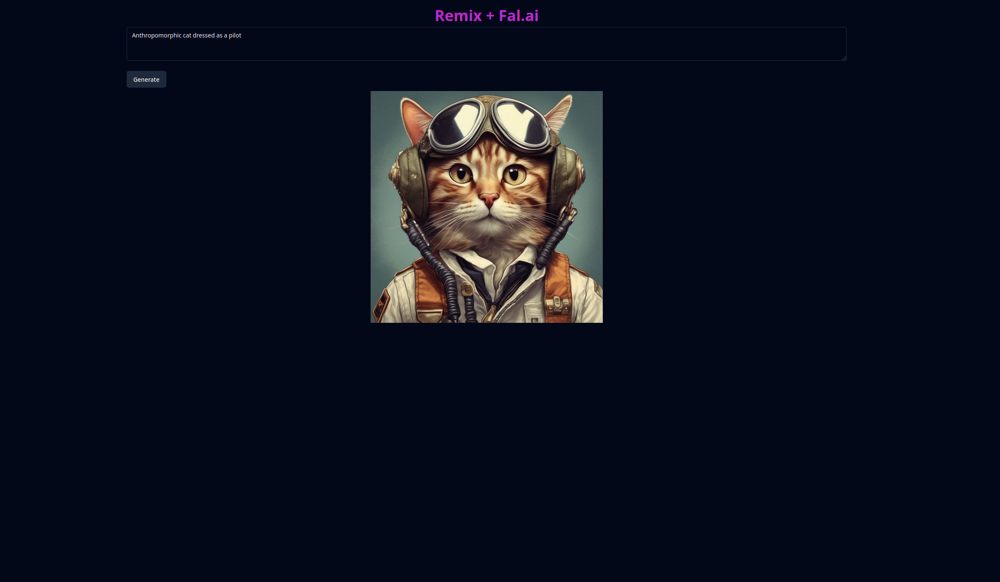

# Remix x Fal.ai



## Getting started (Linux)

1. Clone the repo

2. CD into the directory and install the deps

```bash
pnpm install
```

3. Rename `.env.example` to `.env` and add your own Fal.ai [API Key](https://www.fal.ai/dashboard/keys)

4. Run the app

```bash
npm run dev
```
